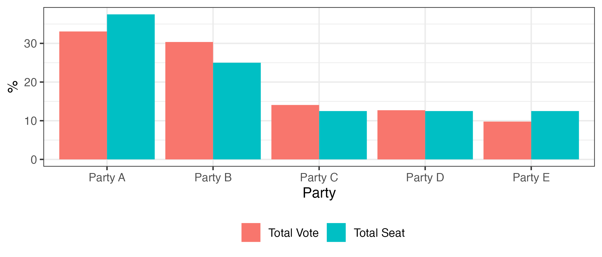
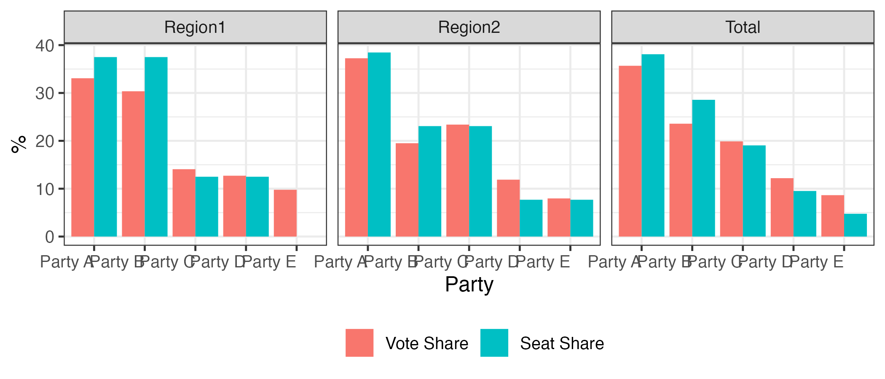
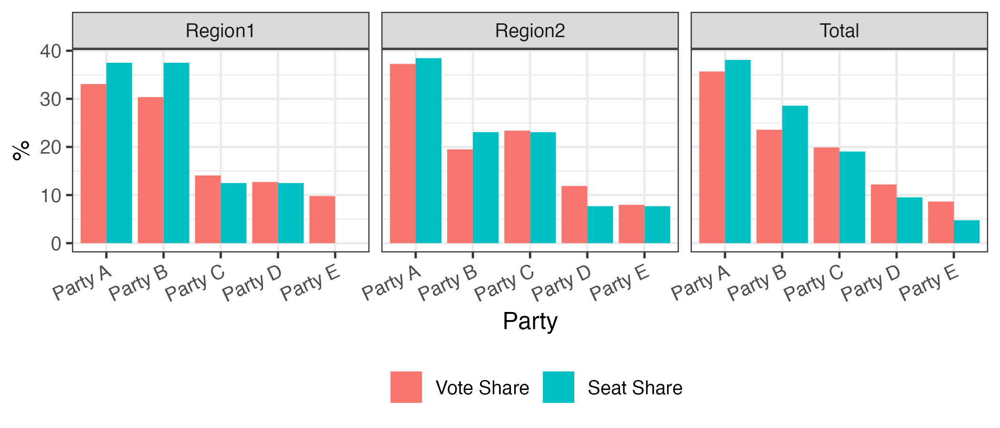
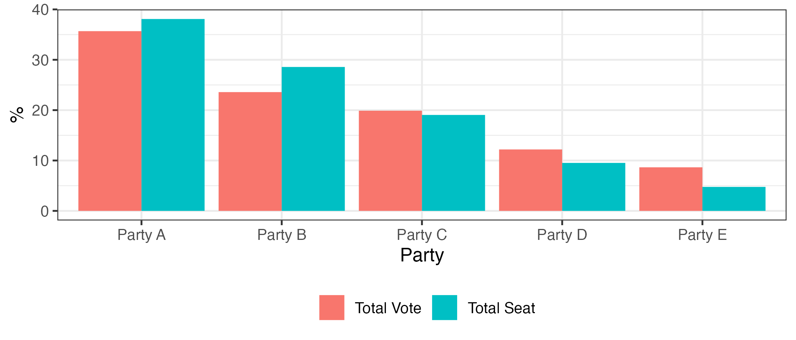
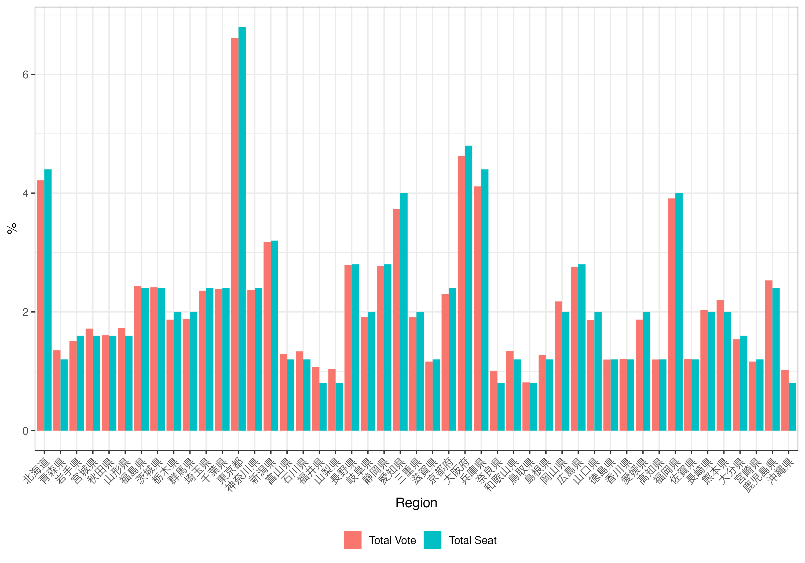
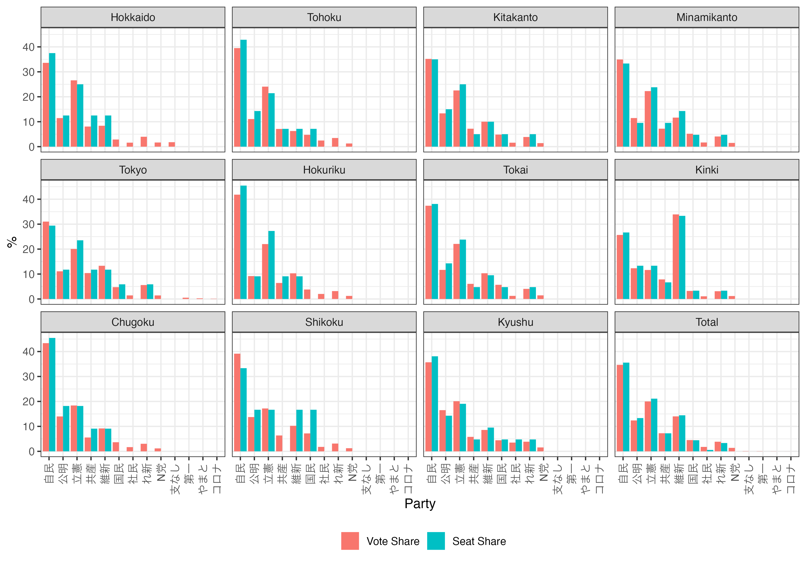
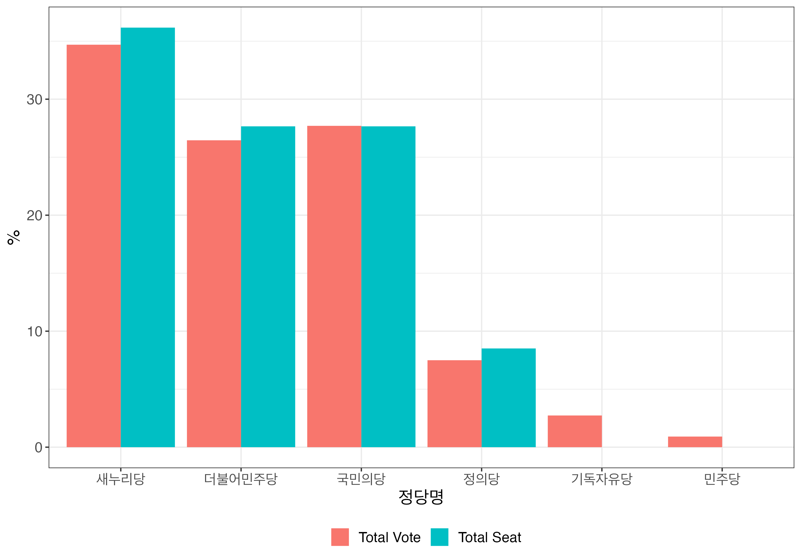

# PRcalc for R
Proportional Representation Calculator for R

---

Current Version: 0.7.0 (2022/03/09)

## Author Information
* Jaehyun SONG, Ph.D.
* Associate Professor at Kansai University, Japan
* <https://www.jaysong.net>

## History

* 2015/04/24 (0.1.0): Release {PRclac}
* 2015/04/25 (0.2.0)
  * An argument, `nparty`, was removed.
  * A name of an argument was changed, voteshare to vote. Also, you can define party names. (Of course, it is okay to left blank.)
  * Disproportionality Index(Gallagher Index) is indicated.
  * Optimized function. You can call the package more faster (a little)
  * `PR.calc.ex()` is included. This function show a sample result.
* 2015/04/26 (0.3.0): You can specify a threshold.
* 2015/04/27 (0.4.0): data.frame type is available for vote argument! You don’t have to type troublesome vector argument.
* 2015/04/28 (0.5.0)
  * {PRcalc} come be available as an R package!
  * Sample datasets included.
* 2015/05/07 (0.6.0)
  * New sample dataset added, `japanese.sample2` (2014 Japanese Lower House Election)
  * Calculating multiple districts simultaneously is possible.
* 2016/04/27 (0.6.1)
  * Bugs fixed
* 2016/04/27 (0.7.0)
  * Major update

---

## インストール

```r
install("remotes") # if {remotes} is not installed
remotes::install_github("JaehyunSong/PRcalc")
```

---

## 使い方

### 比例代表の議席割当計算

#### 例1) 全国区 & 5つの政党

* 議席数8 (`seats = 8`)、修正サン＝ラゲ方式 (`method = "msl"`)、阻止条項なし (`threshold = 0`)

| 政党名  | 得票数 |
|:-------:|-------:|
| Party A | 778000 |
| Party B | 714000 |
| Party C | 331000 |
| Party D | 229000 |
| Party E | 230000 |


```r
Election_Data1 <- data.frame(Party = c("Party A", "Party B", "Party C",
                                       "Party D", "Party E"),
                             Votes = c(778000, 714000, 331000, 299000, 230000))

Election_Data1
```

```
##     Party  Votes
## 1 Party A 778000
## 2 Party B 714000
## 3 Party C 331000
## 4 Party D 299000
## 5 Party E 230000
```

```r
# 議席数8、修正サン＝ラゲ方式、阻止条項なし
PR_example1 <- PRcalc(Election_Data1, seats = 8, method = "msl", threshold = 0)

PR_example1
```

```
##     Party Votes_V Votes_S
## 1 Party A  778000       3
## 2 Party B  714000       2
## 3 Party C  331000       1
## 4 Party D  299000       1
## 5 Party E  230000       1
```

#### 例2) 全国区 & 5つの政党 & 阻止条項10%

* `Election_Data1`と同じ設定 + 阻止条項10% (`threshold = 0.1`)


```r
# 議席数8、修正サン＝ラゲ方式、阻止条項15%
PR_example2 <- PRcalc(Election_Data1, seats = 8, method = "msl", threshold = 0.1)

PR_example2
```

```
##     Party Votes_V Votes_S
## 1 Party A  778000       3
## 2 Party B  714000       3
## 3 Party C  331000       1
## 4 Party D  299000       1
## 5 Party E  230000       0
```

#### 例3) ブロック制 & 5つの政党

* 議席数8、13 (`seats = c(8, 13)`)、ドント方式 (`method = "dt"`)、阻止条項なし (`threshold = 0`)

| 政党名  | ブロック1の得票数 | ブロック2の得票数 |
|:-------:|------------------:|------------------:|
| Party A | 778000            | 1454000           |
| Party B | 714000            | 761000            |
| Party C | 331000            | 913000            |
| Party D | 229000            | 464000            |
| Party E | 230000            | 311000            |


```{r examples-PRcalc-3}
Election_Data3 <- data.frame(Party   = c("Party A", "Party B", "Party C",
                                         "Party D", "Party E"),
                             Region1 = c(778000, 714000, 331000, 299000, 230000),
                             Region2 = c(1454000, 761000, 913000, 464000, 311000))

Election_Data3
```

```
##     Party Region1 Region2
## 1 Party A  778000 1454000
## 2 Party B  714000  761000
## 3 Party C  331000  913000
## 4 Party D  299000  464000
## 5 Party E  230000  311000
```

```r
PR_example3 <- PRcalc(Election_Data3, seats = c(8, 13), method = "dt", threshold = 0)

PR_example3
```

```
##     Party Region1_V Region2_V Total_V Region1_S Region2_S Total_S
## 1 Party A    778000   1454000 2232000         3         5       8
## 2 Party B    714000    761000 1475000         3         3       6
## 3 Party C    331000    913000 1244000         1         3       4
## 4 Party D    299000    464000  763000         1         1       2
## 5 Party E    230000    311000  541000         0         1       1
```

```r
# 得票「率」と議席「率」を示す場合
print(PR_example3, prop = TRUE)
```

```
##     Party Region1_V Region2_V Total_V Region1_S Region2_S Total_S
## 1 Party A    33.078    37.253  35.683    37.500    38.462  38.095
## 2 Party B    30.357    19.498  23.581    37.500    23.077  28.571
## 3 Party C    14.073    23.392  19.888    12.500    23.077  19.048
## 4 Party D    12.713    11.888  12.198    12.500     7.692   9.524
## 5 Party E     9.779     7.968   8.649     0.000     7.692   4.762
```

```r
# 小数点の桁数を調整する場合
print(PR_example3, prop = TRUE, digits = 1)
```

```
##     Party Region1_V Region2_V Total_V Region1_S Region2_S Total_S
## 1 Party A      33.1      37.3    35.7      37.5      38.5    38.1
## 2 Party B      30.4      19.5    23.6      37.5      23.1    28.6
## 3 Party C      14.1      23.4    19.9      12.5      23.1    19.0
## 4 Party D      12.7      11.9    12.2      12.5       7.7     9.5
## 5 Party E       9.8       8.0     8.6       0.0       7.7     4.8
```

`summary()`関数を使用するとブロックごとの得票数 (率)、議席数 (率)が省略されます。使い方は`print()`と同じです。

```r
summary(PR_example3)
summary(PR_example3, prop = TRUE, digits = 2)
```

```
##     Party Total_Vote Total_Seat
## 1 Party A    2232000          8
## 2 Party B    1475000          6
## 3 Party C    1244000          4
## 4 Party D     763000          2
## 5 Party E     541000          1
```

### 各種指標の計算

```r
Election_Data1 <- data.frame(Party = c("Party A", "Party B", "Party C",
                                       "Party D", "Party E"),
                             Votes = c(778000, 714000, 331000, 299000, 230000))
Election_Data2 <- data.frame(Party   = c("Party A", "Party B", "Party C",
                                         "Party D", "Party E"),
                             Region1 = c(778000, 714000, 331000, 299000, 230000),
                             Region2 = c(1454000, 761000, 913000, 464000, 311000))

PR_example1 <- PRcalc(Election_Data1, seats = 8, method = "msl", threshold = 0)
PR_example2 <- PRcalc(Election_Data1, seats = 8, method = "msl", threshold = 0.1)
PR_example3 <- PRcalc(Election_Data2, seats = c(8, 13), method = "dt", threshold = 0)

PR_index1 <- index(PR_example1)
PR_index2 <- index(PR_example2)
PR_index3 <- index(PR_example3)

PR_index1
```

```
##             Index Value
## 1      ENP (Vote) 4.047
## 2      ENP (Seat) 4.000
## 3       Gallagher 5.393
## 4 Loosemore–Hanby 7.143
## 5             Rae 2.857
## 6   Sainte–Laguë 2.473
## 7         D'Hondt 1.278
## 8    D'Hondt (5%) 1.278
```

```r
print(PR_index2, digits = 1)
```

```
##             Index Value
## 1      ENP (Vote)   4.0
## 2      ENP (Seat)   3.2
## 3       Gallagher   9.2
## 4 Loosemore–Hanby  11.6
## 5             Rae   3.3
## 6   Sainte–Laguë  12.2
## 7         D'Hondt   1.2
## 8    D'Hondt (5%)   1.2
```

```r
PR_index3$gallagher # Gallagher非比例性指標のみ抽出
```

```
## [1] 5.181161
```

### 可視化

可視化の場合、得票**率**と議席**率**が表示されます。


```r
Election_Data1 <- data.frame(Party = c("Party A", "Party B", "Party C",
                                       "Party D", "Party E"),
                             Votes = c(778000, 714000, 331000, 299000, 230000))

PR_example1 <- PRcalc(Election_Data1, seats = 8, method = "msl", threshold = 0)

plot(PR_example1) # PR_example1の可視化
```



```r
Election_Data2 <- data.frame(Party   = c("Party A", "Party B", "Party C",
                                         "Party D", "Party E"),
                             Region1 = c(778000, 714000, 331000, 299000, 230000),
                             Region2 = c(1454000, 761000, 913000, 464000, 311000))

PR_example2 <- PRcalc(Election_Data2, seats = c(8, 13), method = "dt", threshold = 0)

plot(PR_example2) # PR_example2の可視化
```



```r
plot(PR_example2, text_angle = 25) # X軸ラベルの回転
```



```r
plot(PR_example2, summary = TRUE) # ブロックごとの図を省略
```



### 比較

```r
# アラバマのパラドックス
Election_Data3 <- data.frame(Party = c("Party A", "Party B", "Party C"),
                             Votes = c(5665, 3685, 1650))

PR_example3 <- PRcalc(Election_Data3, seats = 10, method = "hare")
PR_example4 <- PRcalc(Election_Data3, seats = 11, method = "hare")

compare(PR_example3, PR_example4)
```

```
##     Party Votes Method1 Method2 Diff
## 1 Party A  5665       5       6    1
## 2 Party B  3685       3       4    1
## 3 Party C  1650       2       1   -1
## Information 
##  # Method1: Hare–Niemeyer (Number of seats =  10 / threshold:  0 )
##  # Method2: Hare–Niemeyer (Number of seats =  11 / threshold:  0 )
##  # Diff   : Method2 - Method1
```

```r
# 議席割当方式の比較
PR_example5 <- PRcalc(Election_Data3, seats = 10, method = "dt")

compare(PR_example3, PR_example5)
```

```
##     Party Votes Method1 Method2 Diff
## 1 Party A  5665       5       6    1
## 2 Party B  3685       3       3    0
## 3 Party C  1650       2       1   -1
## Information 
##  # Method1: Hare–Niemeyer (Number of seats =  10 / threshold:  0 )
##  # Method2: D'Hondt (Jefferson) (Number of seats =  10 / threshold:  0 )
##  # Diff   : Method2 - Method1
```

```r
compare(PR_example3, PR_example4, type = "index")
```

```
##             Index Method1 Method2   Diff
## 1      ENP (Vote)   2.500   2.500  0.000
## 2      ENP (Seat)   2.632   2.283 -0.349
## 3       Gallagher   4.444   5.118  0.674
## 4 Loosemore–Hanby   5.000   5.909  0.909
## 5             Rae   3.333   3.939  0.606
## 6    Sainte–Laguë   2.076   2.753  0.677
## 7         D'Hondt   1.333   1.085 -0.248
## 8    D'Hondt (5%)   1.333   1.085 -0.248
## Information 
##  # Method1: Hare–Niemeyer (Number of seats =  10 / threshold:  0 )
##  # Method2: Hare–Niemeyer (Number of seats =  10 / threshold:  0 )
##  # Diff   : Method2 - Method1
```

```r
compare(PR_example3, PR_example5, type = "index", digits = 1)
```

```
##             Index Method1 Method2 Diff
## 1      ENP (Vote)     2.5     2.5  0.0
## 2      ENP (Seat)     2.6     2.2 -0.5
## 3       Gallagher     4.4     7.4  3.0
## 4 Loosemore–Hanby     5.0     8.5  3.5
## 5             Rae     3.3     5.7  2.3
## 6    Sainte–Laguë     2.1     3.4  1.4
## 7         D'Hondt     1.3     1.2 -0.2
## 8    D'Hondt (5%)     1.3     1.2 -0.2
## Information 
##  # Method1: Hare–Niemeyer (Number of seats =  10 / threshold:  0 )
##  # Method2: D'Hondt (Jefferson) (Number of seats =  10 / threshold:  0 )
##  # Diff   : Method2 - Method1
```

### サンプルデータ

サンプルデータは以下の通りです。

| データ名 | 説明 | 国 |
|:---------|:-----|:---|
|`jp_census_1920`|都道府県別人口 (1920年)|日本|
|`jp_census_1945`|都道府県別人口 (1945年)|日本|
|`jp_census_1970`|都道府県別人口 (1970年)|日本|
|`jp_census_2015`|都道府県別人口 (2015年)|日本|
|`jp_lower_2009`|衆議院議員総選挙比例区得票数 (2009年)|日本|
|`jp_lower_2012`|衆議院議員総選挙比例区得票数 (2012年)|日本|
|`jp_lower_2014`|衆議院議員総選挙比例区得票数 (2014年)|日本|
|`jp_lower_2017`|衆議院議員総選挙比例区得票数 (2017年)|日本|
|`jp_lower_2021`|衆議院議員総選挙比例区得票数 (2021年)|日本|
|`jp_upper_2019`|参議院議員通常選挙比例区得票数 (2021年)|日本|
|`kr_lower_2004`|韓国国会議員総選挙比例区得票数 (2004年)|韓国|
|`kr_lower_2006`|韓国国会議員総選挙比例区得票数 (2008年)|韓国|
|`kr_lower_2012`|韓国国会議員総選挙比例区得票数 (2012年)|韓国|
|`kr_lower_2016`|韓国国会議員総選挙比例区得票数 (2016年)|韓国|
|`us_census_2020`|アメリカ州別人口 (2020年)|アメリカ|


```r
data(jp_census_1920)

head(jp_census_1920)
```

```
##     Pref     Pop
## 1 北海道 2359183
## 2 青森県  756454
## 3 岩手県  845540
## 4 宮城県  961768
## 5 秋田県  898537
## 6 山形県  968925
```

```r
tail(jp_census_1920)
```

```
##        Pref     Pop
## 42   長崎県 1136182
## 43   熊本県 1233233
## 44   大分県  860282
## 45   宮崎県  651097
## 46 鹿児島県 1415582
## 47   沖縄県  571572
```

```r
PR_sample1 <- PRcalc(jp_census_1920, seats = 250, method = "dt")
index(PR_sample1)
```

```
##             Index  Value
## 1      ENP (Vote) 36.658
## 2      ENP (Seat) 35.471
## 3       Gallagher  0.633
## 4 Loosemore–Hanby  2.414
## 5             Rae  0.103
## 6    Sainte–Laguë  0.455
## 7         D'Hondt  1.075
## 8    D'Hondt (5%)  1.075
```

```r
plot(PR_sample1, xlab = "Region", text_angle = 45)
```



```r
data(jp_census_2015)

PR_sample2 <- PRcalc(jp_census_2015, seats = 250, method = "adams")
PR_sample3 <- PRcalc(jp_census_2015, seats = 250, method = "dt")

compare(PR_sample2, PR_sample3)
```

```
##       Party    Votes Method1 Method2 Diff
## 1    北海道  5381733      10      11    1
## 2    青森県  1308265       3       2   -1
## 3    岩手県  1279594       3       2   -1
## 4    宮城県  2333899       5       5    0
## 5    秋田県  1023119       2       2    0
## 6    山形県  1123891       2       2    0
## 7    福島県  1914039       4       4    0
## 8    茨城県  2916976       6       6    0
## 9    栃木県  1974255       4       4    0
## 10   群馬県  1973115       4       4    0
## 11   埼玉県  7266534      13      15    2
## 12   千葉県  6222666      11      13    2
## 13   東京都 13515271      24      29    5
## 14 神奈川県  9126214      17      19    2
## 15   新潟県  2304264       5       4   -1
## 16   富山県  1066328       2       2    0
## 17   石川県  1154008       3       2   -1
## 18   福井県   786740       2       1   -1
## 19   山梨県   834930       2       1   -1
## 20   長野県  2098804       4       4    0
## 21   岐阜県  2031903       4       4    0
## 22   静岡県  3700305       7       7    0
## 23   愛知県  7483128      14      16    2
## 24   三重県  1815865       4       3   -1
## 25   滋賀県  1412916       3       3    0
## 26   京都府  2610353       5       5    0
## 27   大阪府  8839469      16      18    2
## 28   兵庫県  5534800      10      11    1
## 29   奈良県  1364316       3       2   -1
## 30 和歌山県   963579       2       2    0
## 31   鳥取県   573441       2       1   -1
## 32   島根県   694352       2       1   -1
## 33   岡山県  1921525       4       4    0
## 34   広島県  2843990       6       6    0
## 35   山口県  1404729       3       3    0
## 36   徳島県   755733       2       1   -1
## 37   香川県   976263       2       2    0
## 38   愛媛県  1385262       3       2   -1
## 39   高知県   728276       2       1   -1
## 40   福岡県  5101556      10      10    0
## 41   佐賀県   832832       2       1   -1
## 42   長崎県  1377187       3       2   -1
## 43   熊本県  1786170       4       3   -1
## 44   大分県  1166338       3       2   -1
## 45   宮崎県  1104069       2       2    0
## 46 鹿児島県  1648177       3       3    0
## 47   沖縄県  1433566       3       3    0
## Information 
##  # Method1: Adams's (Number of seats =  250 / threshold:  0 )
##  # Method2: D'Hondt (Jefferson) (Number of seats =  250 / threshold:  0 )
##  # Diff   : Method2 - Method1
```

```r
compare(PR_sample2, PR_sample3, type = "index")
```

```
##             Index Method1 Method2   Diff
## 1      ENP (Vote)  23.540  23.540  0.000
## 2      ENP (Seat)  26.238  21.448 -4.790
## 3       Gallagher   1.261   1.130 -0.131
## 4 Loosemore–Hanby   4.385   3.977 -0.408
## 5             Rae   0.183   0.166 -0.017
## 6   Sainte–Laguë   1.432   1.176 -0.256
## 7         D'Hondt   1.773   1.091 -0.682
## 8    D'Hondt (5%)   1.464   1.091 -0.373
## Information 
##  # Method1: Adams's (Number of seats =  250 / threshold:  0 )
##  # Method2: D'Hondt (Jefferson) (Number of seats =  250 / threshold:  0 )
##  # Diff   : Method2 - Method1
```

```r
data(jp_lower_2021)

PR_sample4 <- PRcalc(jp_lower_2021, method = "hare",
                     seats = c(8, 14, 20, 21, 17, 11, 21, 30, 11, 6, 21))

summary(PR_sample4)
```

```
##     Party Total_Vote Total_Seat
## 1    自民   19914883         64
## 2    公明    7114282         24
## 3    立憲   11492095         38
## 4    共産    4166076         13
## 5    維新    8050830         26
## 6    国民    2593397          8
## 7    社民    1018588          1
## 8    れ新    2215648          6
## 9     N党     796788          0
## 10 支なし      46142          0
## 11   第一      33661          0
## 12 やまと      16970          0
## 13 コロナ       6620          0
```

```r
plot(PR_sample4, text_angle = 90)
```



```r
data(kr_lower_2016)

PR_sample5 <- PRcalc(kr_lower_2016, method = "hare", seats = 47)
PR_sample6 <- PRcalc(kr_lower_2016, method = "hare", seats = 47, threshold = 0.05)

compare(PR_sample5, PR_sample6)
```

```
##      Party   Votes Method1 Method2 Diff
## 1   セヌリ 7960272      16      17    1
## 2 共に民主 6069744      13      13    0
## 3     国民 6355572      13      13    0
## 4     正義 1719891       4       4    0
## 5     基督  626853       1       0   -1
## 6     民主  209872       0       0    0
## Information 
##  # Method1: Hare–Niemeyer (Number of seats =  47 / threshold:  0 )
##  # Method2: Hare–Niemeyer (Number of seats =  47 / threshold:  0.05 )
##  # Diff   : Method2 - Method1
```

```r
plot(PR_sample6, text_size = 16)
```


